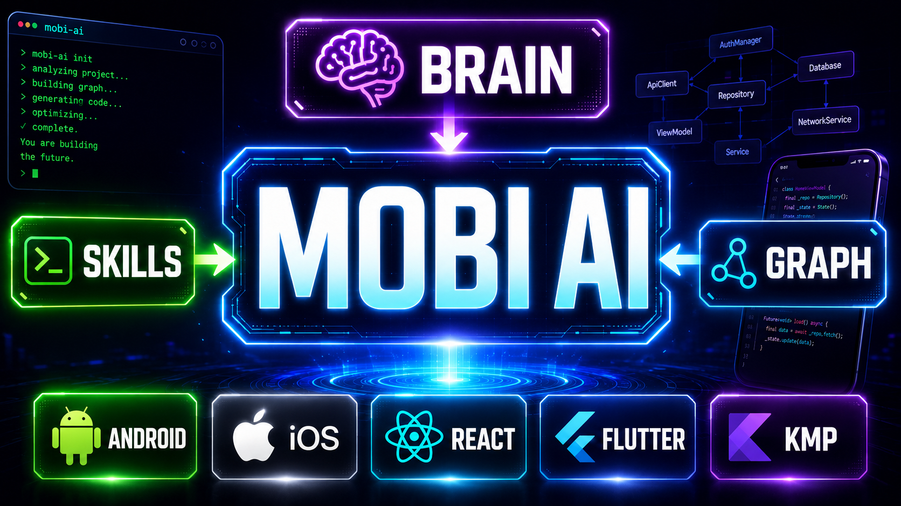

<div align="center">
  
</div>

> **Read in another language:** **English** · [Español](README.es.md)

# MobiAI-Core

<div align="center">


</div>

Evolve your mobile stack with Artificial Intelligence.

## What is MobiAI?

MobiAI is an Open Source ecosystem designed to bring Artificial Intelligence to the heart of your mobile workflow. Four pieces that fit together — click any of them for the full detail:

| | | |
|---|---|---|
| 🛠️ **[CLI `mobiai`](cli/README.md)** | A single tool to manage the whole stack: install skills, index your code, manage project memory, and keep everything up to date. | [See detail →](cli/README.md) |
| 🧩 **[Skills](skills/README.md)** | Expert per-platform context: fix bugs, reproduce incidents, write tests, analyze crashes, create PRs… all following each stack's best practices. | [See detail →](skills/README.md) |
| 🔍 **[Graph](docs/graph/README.md)** | Semantic exploration of mobile code. Answers "which files to touch for this task" or "who calls this symbol" without walking the repo blindly. | [See detail →](docs/graph/README.md) |
| 🧠 **[Brain](brain/README.md)** | Living per-project memory: decisions, bugfixes, workarounds, and project-specific integrations, kept separate from MobiAI's global state. | [See detail →](brain/README.md) |

And two more pieces on the horizon:

- **Agents** — Specialized agents that execute complex tasks autonomously (in development).
- **Automated pipeline** — A bot that receives tickets from your messaging platform, reproduces the bug, applies the fix, and opens the PR (planned).

Compatible with **Claude Code**, **Cursor**, **Copilot CLI**, **Codex**, and **Gemini CLI**.

## Current status

| Component | Status |
|------------|--------|
| CLI `mobiai` | Stable |
| Skills (multi-platform) | Stable |
| Graph (semantic indexer) | Alpha |
| Brain (per-project memory) | Alpha |
| Autonomous agents | In development |
| Automated pipeline (messaging bot) | Planned |
| Community skills marketplace | Planned |

## Installation

MobiAI installs as a standalone CLI (`mobiai`) that detects your assistant (Claude Code, Cursor, Copilot CLI, Codex, Gemini CLI) and pushes skills to the right place.

```bash
# Mac / Linux
curl -fsSL https://mobiai.dev/install.sh | sh

# Windows (cmd)
curl.exe -fsSL https://mobiai.dev/install.cmd -o "%TEMP%\i.cmd" && "%TEMP%\i.cmd"

# Windows (PowerShell)
iwr -useb https://mobiai.dev/install.ps1 | iex
```

Verify the install:

```bash
mobiai --version
mobiai doctor      # diagnoses detected hosts, catalog, and permissions
```

Full install details, local builds, and releases in [cli/README.md](cli/README.md).

### First use

```bash
mobiai             # banner + help
mobiai skills init # interactive selector to pick packs (mobile, android, ios, kmp, flutter, react-native)
```

Keeping things up to date (`mobiai update` refreshes the catalog and self-updates the binary) and diagnostics (`mobiai doctor`, `mobiai status`) live inside the CLI — see [cli/README.md](cli/README.md).

## The CLI in three blocks

> Quick summary. Each block has its own README with the full detail.

### 🧩 [Skills](skills/README.md) — manage skills

Install, list, and uninstall skill packs in the detected hosts. A `mobile` meta-pack brings everything, or install per-platform packs individually.

```bash
mobiai skills init                 # interactive selector
mobiai skills add mobile           # install the whole stack
mobiai skills list                 # what you have installed
```

Packs: `mobile`, `android`, `ios`, `kmp`, `flutter`, `react-native`. → [skills/README.md](skills/README.md)

### 🔍 [Graph](docs/graph/README.md) — semantic code exploration

Indexes your mobile project and answers "which files to touch" or "who calls this symbol" without walking the repo blindly. Downstream skills (debugging, fix-issue, planning) pre-flight Graph when available.

```bash
mobiai graph init                  # indexes the project into .mobiai/graph/
mobiai graph context <task...>     # relevant files for a task
```

→ [docs/graph/README.md](docs/graph/README.md)

### 🧠 [Brain](brain/README.md) — per-project memory

Living per-repo memory: decisions, bugfixes, workarounds, and project-specific integrations, separate from MobiAI's global state. Stored under `<repo>/.mobiai/brain/`.

```bash
mobiai brain init                  # creates .mobiai/brain/ (idempotent)
mobiai brain context               # prints Markdown ready for agents
```

→ [brain/README.md](brain/README.md)

## How does it work?

1. **Install the `mobiai` CLI** — a single binary that detects your assistant (Claude Code, Cursor, Copilot CLI, Codex, or Gemini CLI) and registers the skills in the right place
2. **Choose your packs** — `mobiai skills init` opens the selector, or install what you need with `mobiai skills add <pack>`
3. **Start coding** — Skills activate automatically based on context; optionally index the repo with `mobiai graph init` and seed memory with `mobiai brain init`
4. **Platform detection** — MobiAI detects your project (Android, iOS, Flutter…) and applies the right context
5. **Your project, your rules** — Skills respect your project conventions (`CLAUDE.md`, `GEMINI.md`, `AGENTS.md`)

## Roadmap

### Phase 1 — Skills (current)
Multi-platform plugin with skills for every mobile platform. Compatible with Claude Code, Cursor, Copilot CLI, Codex, and Gemini CLI. The community can contribute new skills.

### Phase 2 — Agents
Specialized agents that go beyond instructions: they analyze code autonomously, interact with devices, and make informed decisions based on context.

### Phase 3 — Automated pipeline
A bot that connects to your favorite messaging platform, receives errors or tickets, orchestrates agents, and produces review-ready PRs — the full bug-fix cycle with no human in the loop.

### Phase 4 — Marketplace
A marketplace where the community publishes and downloads skills, agents, and configurations for different kinds of mobile projects.

## Contributing

We'd love your help! MobiAI is built by mobile developers, for mobile developers.

- **Add a new skill**: see the [skill-authoring guide](docs/crear-skills.md)
- **Improve existing skills**: open a PR with better instructions or edge-case handling
- **Report problems**: open an issue if a skill gives bad advice or is missing something

See [CONTRIBUTING.md](CONTRIBUTING.md) for more details.

## 👀 Want to stay up to date?

Join the [community Discord](https://bit.ly/3bmeQvm) where we have a channel for the project (`🤖-mobiai`).

## 👨‍💻 Contributors

<a href="https://github.com/ArisGuimera/JetpackComposePro/graphs/contributors">
  
</a>


---

<div align="center">
<a href="LICENSE"></a>
</div>
