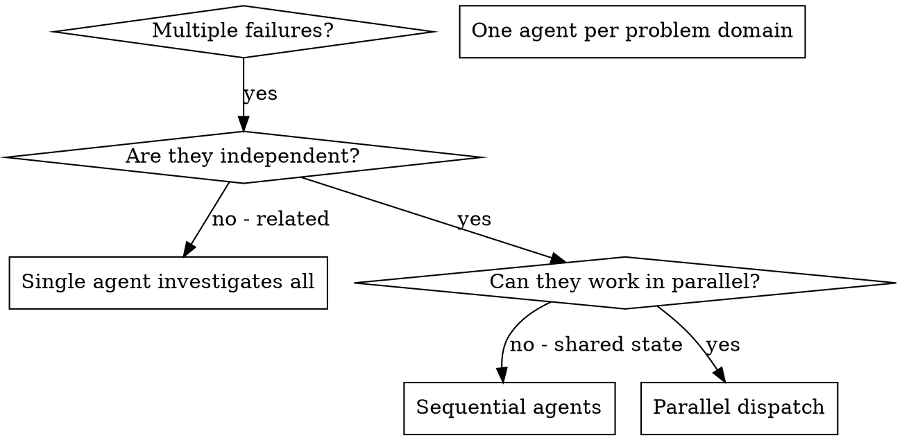

# Dispatching Parallel Mobile Agents

## Overview

You delegate tasks to specialized agents with isolated context. By precisely crafting their instructions and context, you ensure they stay focused and succeed at their task. They should never inherit your session's context or history — you construct exactly what they need.

When you have multiple unrelated failures (different test files, different subsystems, different bugs), investigating them sequentially wastes time.

**Core principle:** Dispatch one agent per independent problem domain. Let them work concurrently.

## When to Use



**Use when:**
- 3+ test files failing with different root causes
- Multiple subsystems broken independently
- Each problem can be understood without context from others
- No shared state between investigations

**Don't use when:**
- Failures are related (fix one might fix others)
- Need to understand full system state
- Agents would interfere (editing same files)

## The Pattern

### 1. Identify Independent Domains

Group failures by what's broken. Each domain is independent - fixing one doesn't affect the other.

### 2. Create Focused Agent Tasks

Each agent gets:
- **Specific scope:** One test file or subsystem
- **Clear goal:** Make these tests pass
- **Constraints:** Don't change other code
- **Expected output:** Summary of what you found and fixed
- **Test command:** Platform-specific command to verify

Example:
```markdown
Fix the 3 failing tests in OrderViewModelTest.kt:

1. "should emit loading state" - expects Loading but gets Idle
2. "should handle empty response" - NullPointerException
3. "should retry on failure" - timeout

Context:
- Test: app/src/test/java/.../OrderViewModelTest.kt
- Source: app/src/main/java/.../OrderViewModel.kt

Run: ./gradlew testDebugUnitTest --tests "com.example.OrderViewModelTest"

Do NOT change other test files or production code outside OrderViewModel.kt.
Return: Summary of root cause and changes.
```

### 3. Dispatch in Parallel

Launch all agents simultaneously. Each works in isolation.

### 4. Review and Integrate

When agents return:
1. **Review each summary** - Understand what changed
2. **Check for conflicts** - Did agents edit same code?
3. **Run full suite** - Verify all fixes work together:

| Platform | Full test command |
|----------|-----------------|
| **Android** | `./gradlew testDebugUnitTest` |
| **iOS** | `xcodebuild test -scheme <Scheme> -destination 'platform=iOS Simulator,name=iPhone 16'` |
| **Flutter** | `flutter test` |
| **React Native** | `npx jest` |

4. **Spot check** - Agents can make systematic errors

## Common Mistakes

**Too broad:** "Fix all tests" → agent gets lost
**No context:** "Fix the race condition" → agent doesn't know where
**No constraints:** Agent might refactor everything
**Vague output:** "Fix it" → you don't know what changed

## When NOT to Use

- **Related failures:** Fix one might fix others - investigate together first
- **Need full context:** Understanding requires seeing entire system
- **Exploratory debugging:** You don't know what's broken yet
- **Shared state:** Agents would interfere (editing same files)
