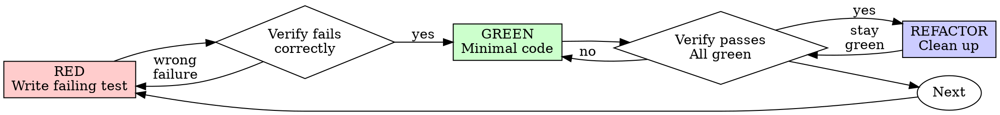

# Mobile Test-Driven Development (TDD)

## Overview

Write the test first. Watch it fail. Write minimal code to pass.

**Core principle:** If you didn't watch the test fail, you don't know if it tests the right thing.

**Violating the letter of the rules is violating the spirit of the rules.**

## When to Use

**Always:**
- New features
- Bug fixes
- Refactoring
- Behavior changes

Thinking "skip TDD just this once"? Stop. That's rationalization.

## The Iron Law

```
NO PRODUCTION CODE WITHOUT A FAILING TEST FIRST
```

Write code before the test? Delete it. Start over.

**No exceptions:**
- Don't keep it as "reference"
- Don't "adapt" it while writing tests
- Delete means delete

## Red-Green-Refactor



### RED - Write Failing Test

Write one minimal test showing what should happen.

**Android (Kotlin):**
```kotlin
@Test
fun `should emit error state when API returns failure`() {
    coEvery { repository.fetchData() } returns Result.failure(IOException())
    viewModel.loadData()
    assertEquals(UiState.Error("Failed to load"), viewModel.state.value)
}
```
Run: `./gradlew testDebugUnitTest --tests "com.example.MyViewModelTest"`

**iOS (Swift):**
```swift
func testShouldEmitErrorStateWhenAPIFails() throws {
    let mockService = MockAPIService()
    mockService.shouldFail = true
    let viewModel = MyViewModel(service: mockService)
    viewModel.loadData()
    XCTAssertEqual(viewModel.state, .error("Failed to load"))
}
```
Run: `xcodebuild test -scheme MyApp -destination 'platform=iOS Simulator,name=iPhone 16' -only-testing:MyAppTests/MyViewModelTests`

**Flutter (Dart):**
```dart
test('should emit error state when API returns failure', () {
  final mockRepo = MockRepository();
  when(mockRepo.fetchData()).thenThrow(Exception('Network error'));
  final viewModel = MyViewModel(mockRepo);
  viewModel.loadData();
  expect(viewModel.state, equals(UiState.error('Failed to load')));
});
```
Run: `flutter test test/my_viewmodel_test.dart`

**React Native (TypeScript):**
```typescript
test('should emit error state when API returns failure', () => {
  const mockFetch = jest.fn().mockRejectedValue(new Error('Network error'));
  const viewModel = createViewModel({ fetchData: mockFetch });
  viewModel.loadData();
  expect(viewModel.state).toEqual({ type: 'error', message: 'Failed to load' });
});
```
Run: `npx jest __tests__/MyViewModel.test.ts`

**Requirements:**
- One behavior
- Clear name
- Real code (no mocks unless unavoidable)

### Verify RED - Watch It Fail

**MANDATORY. Never skip.**

Confirm:
- Test fails (not errors)
- Failure message is expected
- Fails because feature missing (not typos)

**Test passes?** You're testing existing behavior. Fix test.

### GREEN - Minimal Code

Write simplest code to pass the test. Don't add features, refactor other code, or "improve" beyond the test.

### Verify GREEN - Watch It Pass

**MANDATORY.**

Run platform-specific test command:

| Platform | Run all tests |
|----------|--------------|
| **Android** | `./gradlew testDebugUnitTest` |
| **iOS** | `xcodebuild test -scheme MyApp -destination 'platform=iOS Simulator,name=iPhone 16'` |
| **Flutter** | `flutter test` |
| **React Native** | `npx jest` |
| **KMP** | `./gradlew allTests` |

Confirm:
- Test passes
- Other tests still pass
- Output pristine (no errors, warnings)

### REFACTOR - Clean Up

After green only:
- Remove duplication
- Improve names
- Extract helpers

Keep tests green. Don't add behavior.

### Repeat

Next failing test for next feature.

## Why Order Matters

**"I'll write tests after to verify it works"**

Tests written after code pass immediately. Passing immediately proves nothing. Test-first forces you to see the test fail, proving it actually tests something.

**"I already manually tested all the edge cases"**

Manual testing is ad-hoc. No record of what you tested. Can't re-run when code changes. Automated tests are systematic.

**"Deleting X hours of work is wasteful"**

Sunk cost fallacy. The time is already gone. Working code without real tests is technical debt.

## Common Rationalizations

| Excuse | Reality |
|--------|---------|
| "Too simple to test" | Simple code breaks. Test takes 30 seconds. |
| "I'll test after" | Tests passing immediately prove nothing. |
| "The build takes too long for TDD" | Run only the specific test, not the full build. All frameworks support single-test execution. |
| "I can't test this — it depends on the framework" | Extract logic into testable units. ViewModel/UseCase/Repository shouldn't depend on the framework. |
| "Need to explore first" | Fine. Throw away exploration, start with TDD. |
| "Test hard = design unclear" | Listen to test. Hard to test = hard to use. |

## Red Flags - STOP and Start Over

- Code before test
- Test after implementation
- Test passes immediately
- Can't explain why test failed
- Rationalizing "just this once"
- "Keep as reference" or "adapt existing code"

**All of these mean: Delete code. Start over with TDD.**

## Example: Bug Fix

**Bug:** Empty email accepted

**RED**
```kotlin
@Test
fun `rejects empty email`() {
    val result = viewModel.submitForm(email = "")
    assertEquals("Email required", result.error)
}
```

**Verify RED:** FAIL with "expected 'Email required', got null"

**GREEN**
```kotlin
fun submitForm(email: String): FormResult {
    if (email.isBlank()) return FormResult(error = "Email required")
    // ...
}
```

**Verify GREEN:** PASS

## Verification Checklist

Before marking work complete:

- [ ] Every new function/method has a test
- [ ] Watched each test fail before implementing
- [ ] Each test failed for expected reason
- [ ] Wrote minimal code to pass each test
- [ ] All tests pass
- [ ] Tests use real code (mocks only if unavoidable)
- [ ] Edge cases and errors covered

Can't check all boxes? You skipped TDD. Start over.

## Final Rule

```
Production code → test exists and failed first
Otherwise → not TDD
```

No exceptions without your human partner's permission.
